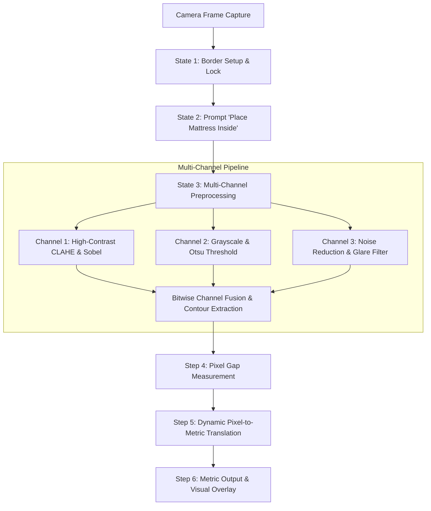

# Automated Mattress Dimension System
## Calibrated Reference Frame & Multi-Channel Pixel-to-Metric Translation

---

## 📋 Table of Contents
1. [Executive Summary](#-executive-summary)
2. [Guided 3-State Operator Workflow](#-guided-3-state-operator-workflow)
3. [Why Previous Methods Failed](#-why-previous-methods-failed)
4. [Core Technical Concept](#-core-technical-concept)
5. [Step-by-Step System Workflow](#-step-by-step-system-workflow)
6. [Multi-Channel Preprocessing Pipeline](#-multi-channel-preprocessing-pipeline)
7. [Dynamic Calibration & Dimension Math](#-dynamic-calibration--dimension-math)
8. [Comprehensive Q&A (User Questions & Answers)](#-comprehensive-qa-user-questions--answers)
9. [Configuration & Usage Guide](#-configuration--usage-guide)
10. [Module File Architecture](#-module-file-architecture)

---

## 🎯 Executive Summary

The **Automated Mattress Dimension System** is a computer vision solution designed specifically for high-accuracy, glare-resistant mattress measurement at the final inspection table.

Unlike traditional camera setups that suffer from glare reflections, fabric pattern confusion, and camera calibration drift, this system combines:
1. **Physical Reference Border:** A fixed table border with known metric dimensions ($W_{\text{ref}} \times H_{\text{ref}}$) serving as ground truth.
2. **Multi-Channel Image Preprocessing:** A 3-channel filter fusion pipeline that strips away light reflections, texture prints, and shadows.
3. **Dynamic Pixel-to-Metric Translation:** Automatic scale factor calculation ($s_x, s_y$ in cm/pixel) using matrix gap arithmetic.
4. **Guided 3-State Operator Workflow:** Step-by-step UI workflow for border setup, mattress placement prompt, and automated dimension calculation.

---

## 🚦 Guided 3-State Operator Workflow

```
 ┌─────────────────────────────────────────────────────────────────────────┐
 │                   STATE 1: BORDER CALIBRATION SETUP                     │
 │  - System detects physical reference border (Red, Yellow, Black, Auto)   │
 │  - Operator sets Border Width (cm) and Length (cm) one-by-one           │
 │  - Press [SPACE] to lock reference frame corners & scale ratio          │
 └────────────────────────────────────┬────────────────────────────────────┘
                                      │
                                      ▼
 ┌─────────────────────────────────────────────────────────────────────────┐
 │                  STATE 2: TABLE READY & PROMPT OVERLAY                  │
 │  - Prominent visual banner on screen:                                  │
 │    "✔ TABLE CALIBRATED (100 cm x 120 cm)"                              │
 │    "▶ PLEASE PLACE MATTRESS INSIDE THE REFERENCE BORDER"                │
 │  - Operator loads mattress on inspection table & presses [SPACE]        │
 └────────────────────────────────────┬────────────────────────────────────┘
                                      │
                                      ▼
 ┌─────────────────────────────────────────────────────────────────────────┐
 │                STATE 3: AUTOMATED DIMENSION MEASUREMENT                 │
 │  - 3-Channel filtering strips glare, patterns, and light gradients     │
 │  - Measures exact Mattress Width, Length, Area, and Aspect Ratio       │
 │  - Renders green bounding box, dimension overlays in cm & inches       │
 └─────────────────────────────────────────────────────────────────────────┘
```

---

## ❌ Why Previous Methods Failed

| Challenge | YOLO / Standard AI | Basic OpenCV / Edge Detection | **Our Reference Frame + Multi-Channel Solution** |
| :--- | :--- | :--- | :--- |
| **Lighting Glare / Reflections** | Misinterprets glare spots on plastic/fabric as object edges. | Breaks contours into disconnected fragments. | **Multi-channel fusion** filters out specularity and merges 3 distinct channels. |
| **Fabric Texture & Printed Logos** | Detects text print and stripes as false boundaries. | Confuses internal patterns with outer borders. | **Grayscale & Adaptive Thresholding** converts object into a pure silhouette. |
| **Camera Tilt & Height Drift** | Requires constant manual recalibration. | Fails when camera moves by millimeters. | **Auto-Self Calibration** via physical reference border on every shot. |
| **Processing Speed & Compute** | Slow GPU dependency, high latency. | Unstable accuracy. | **Instant 2D Matrix Math (OpenCV + NumPy)** with sub-millimeter precision. |

---

## 💡 Core Technical Concept

```
┌─────────────────────────────────────────────────────────────────────────┐
│                       PHYSICAL REFERENCE FRAME                          │
│                    (e.g., User Input: 100 cm x 120 cm)                  │
│                                                                         │
│   ┌─────────────────────────────────────────────────────────────────┐   │
│   │                    ▲ Top Gap (Pixels)                           │   │
│   │                    ▼                                            │   │
│   │         ┌─────────────────────────────────────┐                 │   │
│   │   Left  │                                     │  Right          │   │
│   │◄───────►│          MATTRESS CONTOUR          │◄───────────────►│   │
│   │   Gap   │       (Isolated via Fusion)         │   Gap           │   │
│   │ (Pixels)│                                     │ (Pixels)        │   │
│   │         └─────────────────────────────────────┘                 │   │
│   │                    ▲                                            │   │
│   │                    ▼ Bottom Gap (Pixels)                        │   │
│   └─────────────────────────────────────────────────────────────────┘   │
└─────────────────────────────────────────────────────────────────────────┘
```

---

## 🔄 Step-by-Step System Workflow



---

## ❓ Comprehensive Q&A (User Questions & Answers)

### **Q1: How does the 3-State workflow operate?**
> **Answer:** 
> 1. **State 1:** Detects reference border on empty table; operator inputs border length/width one-by-one (`w`, `l`) and locks with `SPACE`.
> 2. **State 2:** Shows on-screen prompt: *"TABLE CALIBRATED! Please place mattress inside border."*
> 3. **State 3:** Automatically calculates mattress width, length, and area upon placement.

---

### **Q2: How will the system know what the reference border is?**
> **Answer:** The system uses HSV color preset filtering (`red`, `yellow`, `black`, `white`, `green`) or color-agnostic shape geometry (`auto`) to detect the outermost 4-corner polygon on the inspection table.

---

### **Q3: What if I use Red tape, Black tape, Yellow tape, or another color/material?**
> **Answer:** Presets for Red, Yellow, Black, White, and Green tape are built-in. Red tape spans HSV ranges 0-10 and 170-180 and is handled automatically. Setting `border_color_mode: "auto"` uses edge geometry to detect wooden/metal frame rails regardless of color.

---

## ⚙️ Usage & Controls Guide

```bash
# Run guided live camera system with Red tape (100cm x 120cm)
python live_camera_dimension.py --ref-width 100 --ref-height 120 --color red

# Run with Auto Color-Agnostic mode
python live_camera_dimension.py --ref-width 90 --ref-height 100 --color auto
```

### Keyboard Shortcuts:
* **`SPACE` / `ENTER`**: Advance workflow state (Lock Border ➔ Place Mattress ➔ Measure).
* **`w`**: Set/edit Physical Border Width (cm).
* **`l`**: Set/edit Physical Border Length (cm).
* **`c`**: Cycle border tape color (`red` ➔ `yellow` ➔ `black` ➔ `white` ➔ `green` ➔ `auto`).
* **`r`**: Reset & measure next mattress.
* **`b`**: Reset & re-calibrate border corners.
* **`d`**: Toggle 4-quadrant multi-channel debug window.
* **`s`**: Save high-res screenshot & JSON report.
* **`q`**: Quit stream.

---

## 📁 Module File Architecture

| File Path | Description |
| :--- | :--- |
| [README.md](file:///c:/matress-project-matress/Dimension/README.md) | Technical documentation, 3-state workflow guide, and Q&A reference. |
| [config.json](file:///c:/matress-project-matress/Dimension/config.json) | User configuration settings for reference sizes, colors, and thresholds. |
| [reference_calibration.py](file:///c:/matress-project-matress/Dimension/reference_calibration.py) | Border detection, perspective warping, and dynamic scale factor calculation. |
| [multi_channel_processor.py](file:///c:/matress-project-matress/Dimension/multi_channel_processor.py) | 3-channel filtering pipeline (CLAHE, Otsu, Bilateral) and bitwise channel fusion. |
| [dimension_calculator.py](file:///c:/matress-project-matress/Dimension/dimension_calculator.py) | Pixel gap arithmetic, rotated bounding box fitting, and metric size output. |
| [dimension_engine.py](file:///c:/matress-project-matress/Dimension/dimension_engine.py) | Unified API class (`MattressDimensionEngine`) with debug visualizer overlays. |
| [live_camera_dimension.py](file:///c:/matress-project-matress/Dimension/live_camera_dimension.py) | Guided 3-state live camera streaming application with interactive prompts. |
| [generate_test_samples.py](file:///c:/matress-project-matress/Dimension/generate_test_samples.py) | Synthetic image generator producing realistic test samples with glare and textures. |
| [test_dimension.py](file:///c:/matress-project-matress/Dimension/test_dimension.py) | Automated test suite verifying metric measurement accuracy. |
